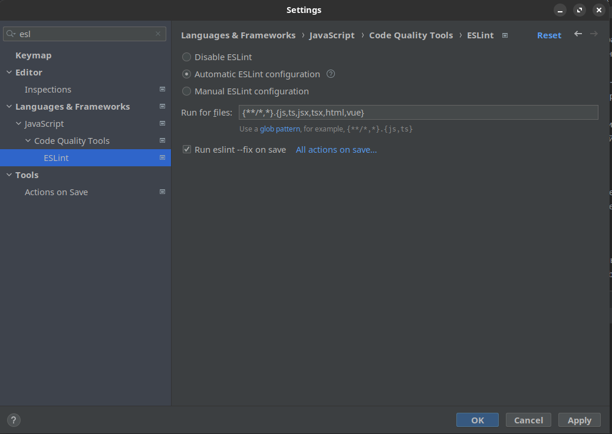
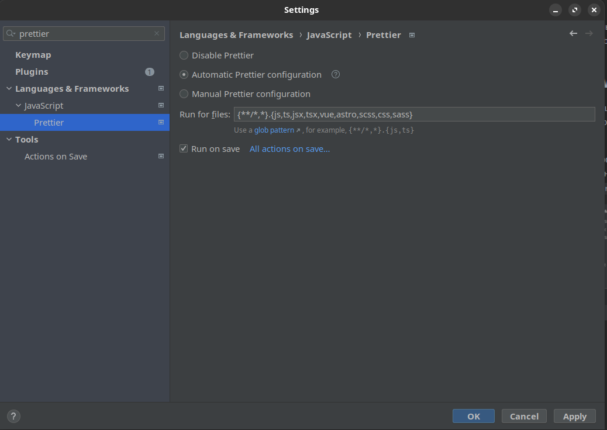
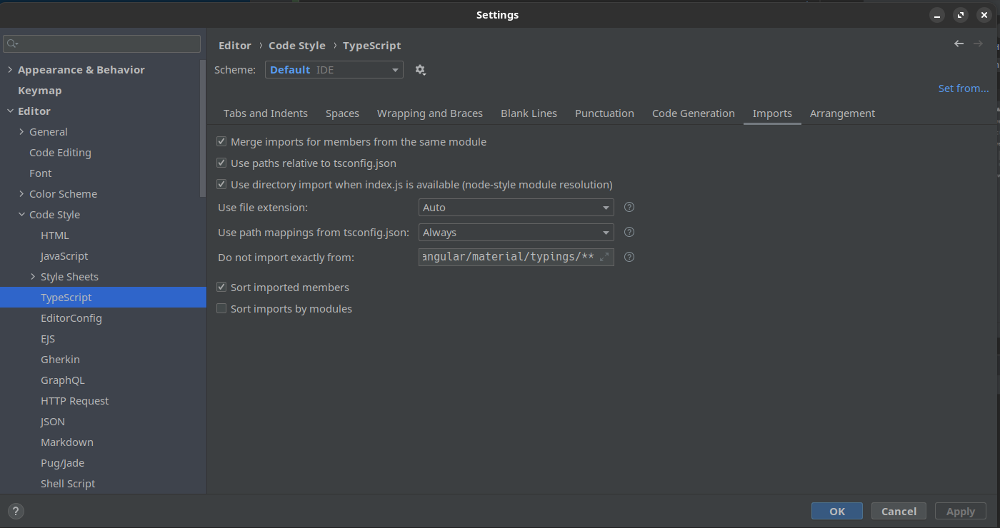
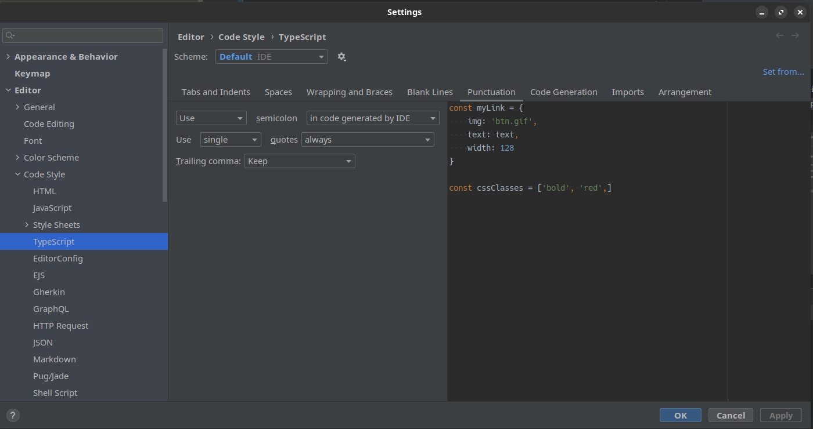

# Event Management System

## Ручной запуск

### Установка nodejs, npm, nvm, yarn

```
1) Установка nvm
  Для linux: curl -o- https://raw.githubusercontent.com/nvm-sh/nvm/v0.39.3/install.sh | bash
  Для windows: https://setiwik.ru/kak-ustanovit-nvm-na-windows/
2) Установка nodejs и npm
  nvm install --lts
3) Установка yarn
  npm install --global yarn
```

### Установка зависимостей проекта (производить в той же директории, где находится package.json)

```
yarn install
```

### Запуск проекта (производить в той же директории, где находится package.json)

```
yarn start
```

## Запуск посредством docker

```
docker-compose up --build -d
Для остановки контейнера - docker-compose down
```

## Краткая характеристика структуры проекта

### `src` - директория с исходными файлами проекта, в ней находятся:

#### `assets` - директория предназначена для хранения:
- `fonts` - шрифты, которые используются на проекте
- `icons` - иконки, которые используются на проекте (.svg)
- `images` - картинки, которые используются на проекте (.png/jpg...)

#### `components` - директория предназначена для хранения "чистых" react компонентов
Компоненты хранятся в плоской структуре, для каждого компонента создаётся соответствующая папка, 
в которой находятся следующие файлы:
- `ComponentName.tsx` - реализация компонента
- `ComponentName.type.ts` - необходимые интерфейсы и типы
- `ComponentName.constants.ts` - необходимые константы
- `ComponentName.module.scss` - стили
- `ComponentName.test.tsx` - тесты для компоненты
- `index.ts` - точка входа

> Важно, чтобы компонент, который находится в данной директории соответствовал понятию "чистый компонент" 
(тупой компонент). То есть его единственной задачей является возврат разметки, в нём не должно происходить side эффектов,
каких-либо запросов в сервисам, мутаций параметров и он не должен содержать внутренного состояния

#### `containers` - директория предназначена для хранения "контейнерных" react компонентов
Компоненты хранятся в плоской структуре, для каждого компонента создаётся соответствующая папка,
в которой находятся следующие файлы:
- `ComponentNameContainer.tsx` - реализация компонента
- `ComponentNameContainer.type.ts` - необходимые интерфейсы и типы
- `ComponentNameContainer.constants.ts` - необходимые константы
- `ComponentNameContainer.test.tsx` - тесты для компоненты
- `index.ts` - точка входа

> Контейнерные компоненты представляют собой обёртки для чистых компонентов, в которых реализуется вся нужная бизнес
логика и поставка данных для чистых компонентов через пропсы.

#### `pages` - директория предназначена для хранения react компонентов, отвечающих за отрисовку целых страниц
Компоненты хранятся в плоской структуре, для каждого компонента создаётся соответствующая папка,
в которой находятся следующие файлы:
- `PageName.tsx` - реализация компонента
- `PageName.type.ts` - необходимые интерфейсы и типы
- `PageName.module.scss` - стили
- `PageName.constants.ts` - необходимые константы
- `PageName.test.tsx` - тесты для компоненты
- `index.ts` - точка входа

> В компонентах-страницах агрегируются все нужные контейнерные, чистые компоненты для реализации какой-либо страницы 
приложения.


#### `routes` - директория предназначена для хранения файлов, организующих логику маршрутизации внутри приложения
Здесь лежат:
- `routes.ts` - набор роутов
- `index.ts` - точка входа

> Также здесь могут храниться различные утилиты для формирования урлов, их склейки и тд. 


#### `services` - директория предназначена для организации взаимодействия приложения со сторонними сервисами
Примером сервисов могут служить различные backend серверы, сервисы геолокаций и тд.
Под каждый новый сервис выделяется соответствующая директория, внутри которой группируются согласно предметной области
нужные папки. Например, у нас есть обычный backend для нашего приложения. Создадим папку `api`. В ней будут папки
`users`, `profile`, `login`. В каждой такой папке будет:

- `serviceNameName.ts` - логика обращения к сервису (apiUsers.ts)
- `serviceNameName.type.ts` - необходимые интерфейсы и типы (apiUsers.type.ts)
- `index.ts` - точка входа

#### `shared` - директория предназначена для хранения общих для всего проекта ресурсов
Директории:
- `constants` - файлы с константами
- `types` - файлы с интерфейсами, типами, енамами
- `utils` -  файлы с утилитами, хелперами. В свою очередь каждую утилиту очень желательно снабжать файлом с тестами:
  - `utilName.ts` - реализация утилиты
  - `utilName.test.ts` - тесты для утилиты


#### `store` - директория предназначена для организации бизнес логики приложения, управления состоянием
Организация структуры для приложения, стейтмененджером которого, является redux, будет происходить следующим образом:
группируются согласно предметной области нужные папки, в каждой из которых есть:

- `actions.ts` - набор экшенов
- `adapters.ts` - набор функций, нужных для адаптирования (сериализации) данных, приходящих с сервисов
- `initalState.ts` - начальное состояние данного модуля
- `requests.ts` - организация запросов на сервис
- `selectors.ts` - набор селекторов
- `slice.ts` - редьюсер, отвечающий за данный модуль
- `types.ts` - необходимые интерфейсы и типы
- `constants.ts` - необходимые константы
- `index.ts` - точка входа

Рядом с этими папками присутствует файл `index.ts`, в котором происходит агрегация всех редьюсеров,
создаются различные middleware, формируется store.

#### `styles` - директория предназначена для хранения палитры, которая используется в стилизации приложения, и миксины
Файлы:

- `colors.scss` - набор цветов
- `mixins.scss` - набор миксинов

#### `App.tsx` - главный компонент приложения
>В компоненте App происходит маршрутиазция на все страницы приложения, формируется основной лэйаут,
подключаются провайдеры стора, тем, языков и тд.

#### `App.module.scss` - главный стилевой файл приложения, где формируется лэйлаут

#### `index.ts` - точка входа приложения
>В текущем DOM нашего документа ищется элемент с id "root", внутрь него рендерим наше реактовское 
приложение

#### `index.scss` - стилевой файл для базовых элементов документа
>Здесь настраиваем стили для таких общих элементов, как `html`, `body`, `scrollbar` и тд. Здесь
мы задаем базовый шрифт, его размер, цвет и толщину, основной фон.

#### `react-app-env.d.ts` - файл с деклорациями пространств имён, классов и интерфейсов.
>В декларациях указывается типизация библиотек, которые не поставляются с файлами типизации,
типизация таких объектов и модулей как window, process.env (переменное окружение), когда мы хотим внести туда
кастомные параметры.


#### `reportWebVitals.ts` - позволяет нам получить результаты производительности нашего приложения с использованием различных метрик


### `public` - директория со статическими файлами приложения:
- `favicon.ico`, `logo.png` - иконки, которые отображаются в браузере, когда мы ищем сайт в
поиске, а также на вкладках.
- `manifest.json` - манифест веб-приложения предоставляет информацию о 
приложении (например, имя, автор, значок и описание) в текстовом файле JSON. 
Целью манифеста является установка веб-приложений на главный экран устройства, предоставляя пользователям более быстрый 
доступ и более широкие возможности.
- `robots.txt` -  текстовый файл, который содержит параметры индексирования сайта для роботов поисковых систем.
- `index.html` - html документ приложения, куда подключаются иконки, манифест, а также определяется корень, куда
будет рендериться приложение. Также здесь мы можем подгружать необходимые скрипты, стилевые файлы

>Помимо вышеперечисленного, в папке `public` мы можем хранить прочие ресурсы, например медиа файлы.
После чего, с помощью системной переменной `process.env.PUBLIC_URL` обращаться к ним из любой точки приложения.
Но стоит использовать данную возможность (а не стандартные импорты) лишь в крайнем случае, так как есть ряд существенных
ограничений.

### Прочие файлы в корневой директории.

- `package.json` - файл управления версиями. Его основное назначение — хранить список зависимостей (библиотек), 
необходимых проекту node.js для работы.
- `yarn.lock` - предназначен для блокировки зависимостей от определенного номера версии. В lock файле 
перечислены зависимости вашего приложения и зависимости всех его зависимостей.
- `tsconfig.json` - конфигурация компилятора typescript
- `craco.config.ts` - файл с конфигурациями ESLint (линтеры), Babel (транспилятор), Webpack (сборщик) и многого другого
- `stylelint*`, `eslint*`, `prettier*` - файлы с конфигурациями линтеров и форматтеров
- также могут содержаться различные отдельные конфиги для системных библиотек, транспиляторв, сборщиков (`babel.config`, 
`webpack.config` и тд.)
- `.env`, `.env.local` и тд - файлы с параметрами переменного окружения, к которым программа
может обращаться во время выполнения.
- `.gitignore` - файлы и директории, которые должны быть проигнорированы системой контроля версий.
- `nginx.default.conf` - конфигурация прокси-сервера nginx
- `Dockerfile` - Dockerfile приложения, описывающий его контейнеризацию
- `docker-compose.yml` - настройка запуска контейнера приложения
- `README.md` - то что сейчас вы читаете) В папке readmeAssets находятся приложения для ридмишки

### node_modules
Папка, которая содержит все необходимые приложению пакеты (модули, библиотеки). Появится сразу же после 
исполнения команды yarn install.

### build
Папка, которая содержит файлы собранного приложения. Формируется при исполнении команды yarn build, 
необходима для деплоя приложения.

## Настройка IDE Webstorm
Так как Webstorm явялется специализированной ide для разработки в стеке react/nodejs/js/ts
нам потребуется минимальная настройка для комфортной разработки
- Настройка линтера. Вбейте в поиске настроек `eslint`, перейдите на пункт,
указанный в скриншоте, выберите пункт `automatic configuration`, нажмите `apply`.


- Настройка форматера. Вбейте в поиске настроек `prettier`, перейдите на пункт,
указанный в скриншоте, выберите пункт `automatic configuration`, добавьте в список
расширений (`Run for files:`) `css`, `scss`, `sass`, поставьте галочку на `Run on save`, нажмите `apply`.

> После чего, при нажатии сочетания `control + s`, а также `control + a и затем control + alt + L` будет происходить 
автоматическое форматирование кода.

- Настройка импортов и кавычек. Перейдите в настройках в `Editor | Code Style | TypeScript | Imports`. Проверьте соответствие
со скриншотом

Перейдите в настройках в `Editor | Code Style | TypeScript | Punctuation`. Проверьте соответствие
со скриншотом



## Happy hacking!